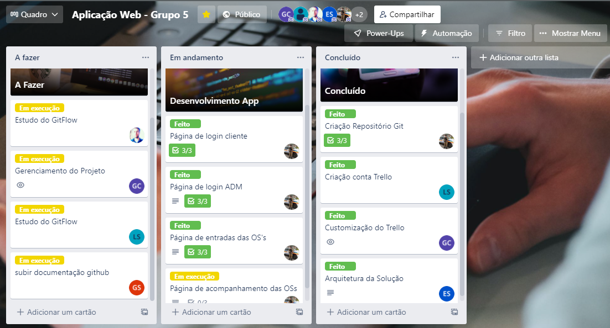
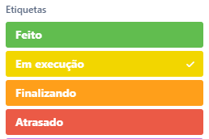

# Metodologia

A metodologia contempla as definições de ferramental utilizado pela equipe tanto para a manutenção dos códigos e demais artefatos quanto para a organização do time na execução das tarefas do projeto.

## Relação dos Ambientes de trabalho

Os artefatos do projeto são desenvolvidos a partir de diversas plataformas e a relação dos ambientes com seu respectivo propósito é apresentada na tabela que se segue.
<table>
<caption>Ambientes de trabalho</caption>
<thead>
 <tr>
  <th>Ambiente</th>
  <th>Plataforma</th>
  <th>Link de Acesso</th>
 </tr>
</thead>
<tbody>
 <tr>
  <td>Repositório de Código Fonte</td>
  <td>GitHub</td>
  <td>https://github.com/ICEI-PUC-Minas-PMV-ADS/pmv-ads-2022-1-e1-proj-web-t6-grupo_5_facility</td>
 </tr>
 <tr>
  <td>Documentos do projeto</td>
  <td>Microsoft OneDrive</td>
  <td>https://onedrive.live.com/?id=EF3CF76DD153B1FD%2159853&cid=EF3CF76DD153B1FD&mid=7568EF689596A3BE%215778&mcid=7568EF689596A3BE&sd=1</td>
 </tr>
 <tr>
  <td>Projeto e Interface e Wireframes</td>
  <td>MarvelApp</td>
  <td>https://marvelapp.com/whiteboard/T2XCLZ2P1JvC209UWWHh</td>
 </tr>
 <tr>
  <td>Gerenciamento do Projeto</td>
  <td>Trello</td>
  <td>https://trello.com/b/CGUQikZj/aplicacao-web-grupo-5</td>
 </tbody>
</table>

## Controle de Versão / Gestão do Código Fonte

Para gestão do código fonte do software desenvolvido pela equipe, o grupo utiliza um processo baseado no Git Flow abordado por Vietro (2015), mostrado na Figura a seguir. Desta forma, todas as manutenções no código são realizadas em branches separados, identificados como Hotfix, Release, Develop e Feature.

O projeto segue a seguinte convenção para o nome de branches:

- `main`: versão estável já testada do software.
- `dev`: versão de desenvolvimento do software com seus respectivos testes.

## Gerenciamento de Projeto

### Divisão de Papéis

A equipe utiliza metodologias ágeis, tendo escolhido o Scrum como base para definição do processo de desenvolvimento.

A equipe está organizada da seguinte maneira:
-	<strong>Scrum Master:</strong> Gabriel Vinícius.
-	<strong>Product Owner:</strong> Bemvilac dos Santos.
-	<strong>Equipe de Desenvolvimento:</strong> Gabriel Vinícius; Gustavo Henrique; Eduardo Ramos.
- <strong>Equipe de Design:</strong> Lucas Alexandre; Guilherme Costa

### Processo

Para organização e distribuição das tarefas do projeto, a equipe está utilizando o Trello estruturado com as seguintes listas: 

-   <strong>A fazer:</strong> esta lista contém as tarefas que devem ser executadas futuramente no projeto.
- 	<strong>Em andamento:</strong> Esta lista representa o Sprint Backlog. Este é o Sprint atual que estamos desenvolvendo
-	<strong>Concluído:</strong> esta lista do trello contém todas as etapas concluídas da aplicação e que já foram testadas pela equipe.

O quadro kanban do grupo no Trello está disponível através da URL https://trello.com/b/CGUQikZj/aplicacao-web-grupo-5 e é apresentado, no estado atual, na figura abaixo. A definição desta estrutura se baseou na proposta feita por Littlefield (2016).

 
A tarefas são, ainda, etiquetadas em função da natureza da atividade e seguem o seguinte esquema de cores/categorias:
-	Feito
-	Em execução
-	Finalizado
-	Atrasado

### Ferramentas

As ferramentas empregadas no projeto são:

- <strong>Editor de código: </strong>O editor de código escolhido pela equipe foi o Microsoft Visual Studio Code. 
- <strong>Ferramentas de comunicação:</strong> Foram utilizadas pela equipe as aplicações Microsoft Teams e WhatsApp.
- <strong>Ferramentas de desenho de tela:</strong> MarvelApp. 

O editor de código foi escolhido porque ele possui uma interface intuitiva, com o uso da extrensão LiveServer o trabalho fica mais ágil, bem como sua integração com a plataforma GitHub favorece a integração das mudanças realizadas pela equipe de desenvolvimento. 
As ferramentas de comunicação utilizadas são de fácil utilização e são amplamente conhecidas pelos integrantes da equipe,  por isso foram selecionadas. 
Por fim, para criar diagramas utilizamos a ferramenta MarvelApp por ser de muito simples utilização.

