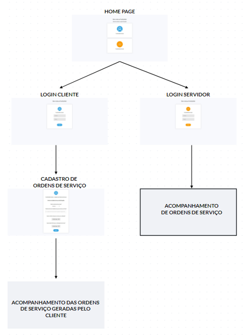
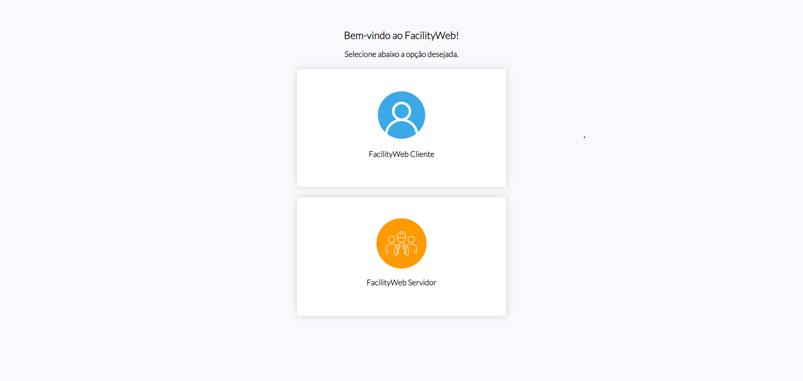
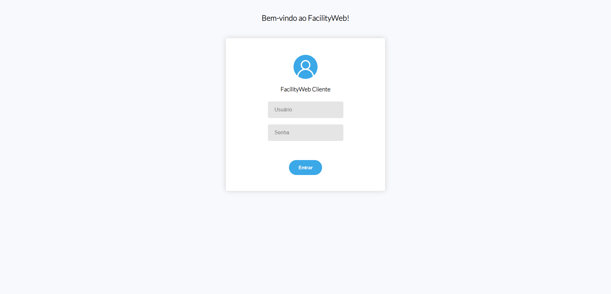
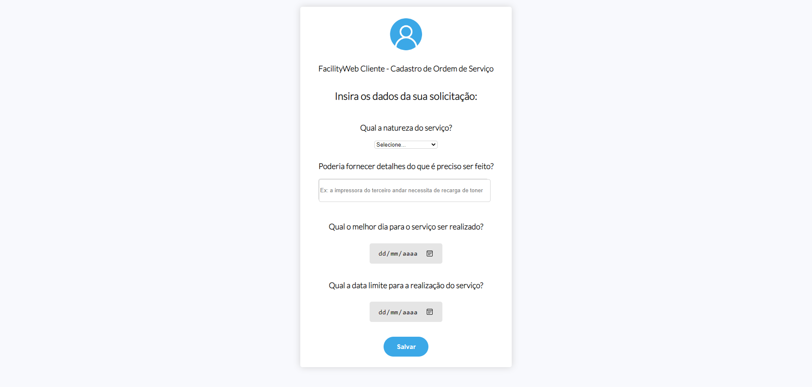
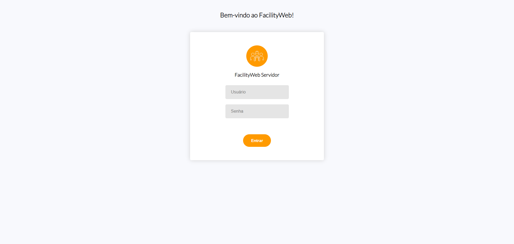

# Projeto de Interface

Dentre as preocupações para a montagem da interface do sistema, estamos estabelecendo foco em questões como agilidade, acessibilidade e usabilidade. Desta forma, o projeto tem uma identidade visual padronizada em todas as telas que são projetadas para funcionamento em desktops e dispositivos móveis.

## User Flow
O diagrama apresentado na figura abaixo mostra o fluxo de interação do usuário pelas telas do sistema. Cada uma das telas deste fluxo é detalhada na seção de Wireframes que se segue. Para visualizar o wireframe interativo, acesse o <a href='https://marvelapp.com/whiteboard/T2XCLZ2P1JvC209UWWHh'>ambiente MarvelApp do projeto</a>. 

## Wireframes

Conforme fluxo de telas do projeto, apresentado no item anterior, as telas do sistema são apresentadas em detalhes nos itens que se seguem. As telas do sistema apresentam uma estrutura comum.
 
 **Tela Home-Page**
 
A tela de Home-Page é o ambiente comum para clientes e colaboradores do setor de facilities. Nesta página o usuário selecionará a opção que corresponde ao seu perfil (cliente ou colaborador) que o remeterá a uma página de login específica para cada perfil. 
Na estrutura padrão da página, há dois ícones, com suas respectivas descrições, em que o usuário poderá clicar para ser direcionado para o ambiente de login. 

-	Componente <strong>FacilityWeb Cliente</strong> permite acessar a página de login do cliente;
-	Componente <strong>FacilityWeb Servidor</strong> permite acessar a página de login dos colaboradores do setor de facility. 

 

**Tela Login do Cliente**

A tela de login do cliente apresenta a identificação da opção selecionada na página Home-Page, bem como campos para entrada de dados pelo cliente, suas informações de nome de usuário e senha. Também apresenta um botão para submeter as informações inseridas para análise e, caso as informações estejam corretas, direcionar para o ambiente do cliente.

 

**Tela Cadastro de Ordem de Serviço**

Assim que o usuário cliente realiza seu login na aplicação ele é direcionado para a tela de cadastro de ordens de serviço. Nesta seção o usuário cliente informara o tipo de serviço necessário (iluminação, segurança, jardinagem, equipamentos, manutenção, etc.). Então é ofertado um campo para que o usuário cliente forneça detalhes de sua solicitação, explicando do que se trata o serviço, por exemplo: a impressora do terceiro andar precisa de uma recarga de toner, é necessário que se faça uma limpeza do jardim dos fundos da empresa, limpeza da vidraça da recepção. Logo abaixo é fornecido um campo para que o cliente informe qual a melhor data para o serviço ser realizado, de modo que o cliente seja melhor atendido. De igual forma, há também um campo para que o cliente informe a data limite da realização do serviço, pois desse modo a equipe de facilities pode se programar caso não seja possível realizar o trabalho na data ideal fornecida pelo cliente.

 

**Tela Login do Servidor**

A tela de login do servidor apresenta a identificação da opção selecionada na página Home-Page, bem como campos para entrada de dados pelo servidor do setor de facility, suas informações de nome de usuário e senha. Também apresenta um botão para submeter as informações inseridas para análise e, caso as informações estejam corretas, direcionar para o ambiente do servidor.

