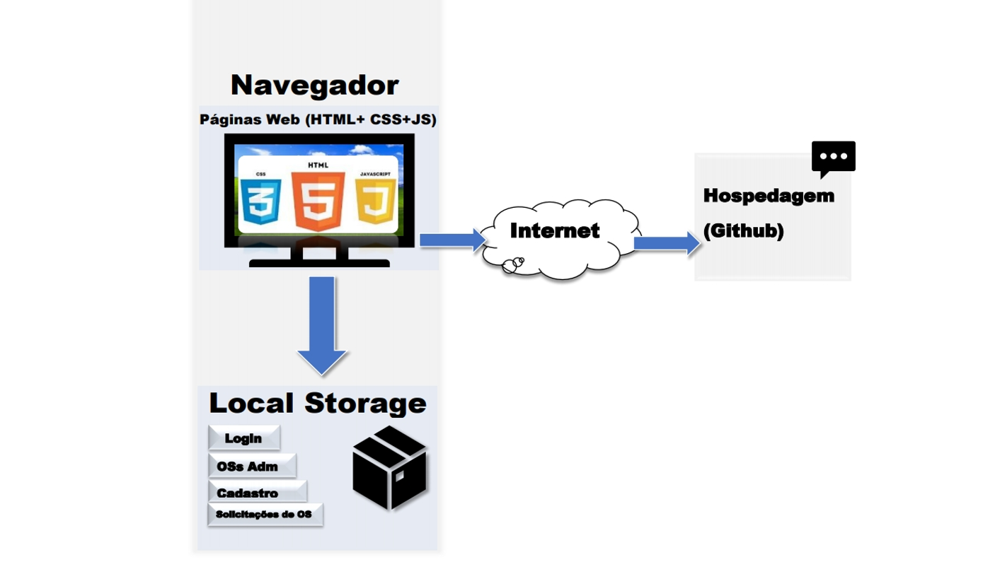

# Arquitetura da Solução

Nesta seção são apresentados os detalhes técnicos da solução criada pela equipe, tratando dos componentes que fazem parte da solução e do ambiente de hospedagem da solução.

## Diagrama de componentes

Os componentes que fazem parte da solução são apresentados na figura que se segue.

A solução implementada conta com os seguintes módulos:
-	**Navegador**> - Interface básica do sistema 
  -	**Páginas Web** - Conjunto de arquivos HTML, CSS, JavaScript e imagens que implementam as funcionalidades do sistema.
  -	**Local Storage** - armazenamento mantido no Navegador, onde são implementados bancos de dados baseados em JSON. São eles:  
      - Cadastro - registro de dados do usuário
      - Login – resgate de dados inseridos pelo usuário no cadastro 
      -	Solicitações de OS - inserção de informações das OS para o encaminhamento da solicitação
      -	OSs Adm - seção de acesso exclusivo do administrador onde se encontra as OSs e suas informações
- **Hospedagem** - local na Internet onde as páginas são mantidas e acessadas pelo navegador. 

## Tecnologias Utilizadas

Neste projeto utilizamos tecnologias de desenvolvimento Front-End, tais como HTML5 para escrever o corpo da página web em que se baseia a solução. Para estilizar as páginas html e deixar a interface mais agradável ao usuário foram implementadas páginas de estilo baseadas em CSS3. Por fim, foi utilizado um código em C# para criar o alerta com o número da ordem de serviço cadastrada pelo cliente no momento em que ele seleciona o botão "salvas" na página "Cadastro de Ordem de Serviço". Todo o código foi escrito partindo do zero, sem implementar nenhuma biblioteca produzida por terceiros, de modo a garantir a originalidade do projeto.

Apresente também uma figura explicando como as tecnologias estão relacionadas ou como uma interação do usuário com o sistema vai ser conduzida, por onde ela passa até retornar uma resposta ao usuário.

## Hospedagem

O site utiliza a plataforma do GitHub Pages como ambiente de hospedagem do site do projeto. O site é mantido no ambiente da URL: https://icei-puc-minas-pmv-ads.github.io/pmv-ads-2022-1-e1-proj-web-t6-grupo_5_facility/.

A publicação do site no GitHub é feita por meio de uma submissão do projeto (push) via git para o repositório remoto do site GitHub que se encontra no endereço: https://github.com/ICEI-PUC-Minas-PMV-ADS/pmv-ads-2022-1-e1-proj-web-t6-grupo_5_facility .
