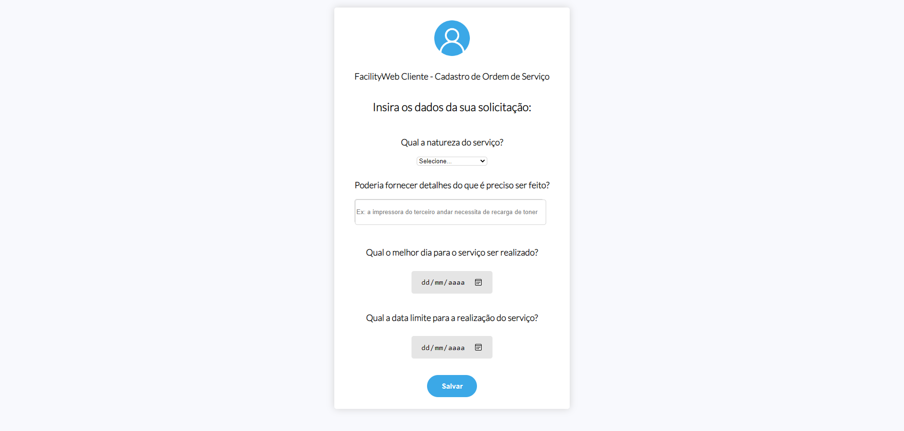

# Programação de Funcionalidades

Nesta seção são apresentadas as telas desenvolvidas para cada uma das funcionalidades da aplicação (requisitos funcionais do sistema). O respectivo endereço (URL) e outras orientações de acesso são são apresentadas juntamente com as funcionalidades à medida que estas são apresentadas.
Implementação do sistema descritas por meio dos requisitos funcionais e/ou não funcionais. Deve relacionar os requisitos atendidos os artefatos criados (código fonte) além das estruturas de dados utilizadas e as instruções para acesso e verificação da implementação que deve estar funcional no ambiente de hospedagem.

## Tela inicial da aplicação (RF-01)

Na tela inicial é apresentado ao usuário duas opções de acesso, em que deverá ser selecionada a que condizer com sua situação, se colaborador ou cliente do setor de facilities da empresa. De acordo com a opção selecionada pelo usuário, este será direcionado para um ambiente de login específico para dar continuidade à utilização da aplicação.

<strong>Requisitos Atendidos</strong>
- RF-01

<strong>Artefatos da funcionalidade</strong>
- index.html
- index.css

<strong>Instruções de acesso</strong>
1. Através de um navegador de Internet (browser), abra a seguinte URL: https://icei-puc-minas-pmv-ads.github.io/pmv-ads-2022-1-e1-proj-web-t6-grupo_5_facility/

## Ambiente de Login de cliente e servidor (RF-02)

Neste espaço, o usuário irá inserir os dados de login para a opção selecionada anteriormente na página inicial da aplicação. Ao realizar o login, será direcionado para o ambiente específico. Ressalta-se que, uma vez que o projeto se baseia unicamente em tecnologias front-end, o ambiente do servidor do setor de facilities não foi desenvolvido, uma vez que demanda a integração com um banco de dados (tecnologia back-end) que condensaria as ordens de serviço já criadas, bem como o andamento da realização destas.

<strong>Requisitos Atendidos</strong>
- RF-02

<strong>Artefatos da funcionalidade</strong>
- login-cliente.html
- login-servidor.html
- estilo-login-cliente.css
- estilo-login-servidor.css

<strong>Instruções de acesso</strong>
Na página inicial, selecione o ícone da opção desejada para ser direcionado ao ambiente de login desejado.

## Ambiente de cadastro de ordem de serviço (RF-03, RF-04, RF-05, RF-06 e RF-07)

Nesta tela o cliente do setor de facility poderá entrar com os dados da sua solicitação, com campos parametrizados com o objetivo de mitigar a entrada de dados de modo indevido.

<strong>Requisitos Atendidos</strong>
- RF-03
- RF-04
- RF-05
- RF-06
- RF-07

<strong>Artefatos da funcionalidade</strong>
- cadastro-de-os.html
- cadastro-de-os.css
