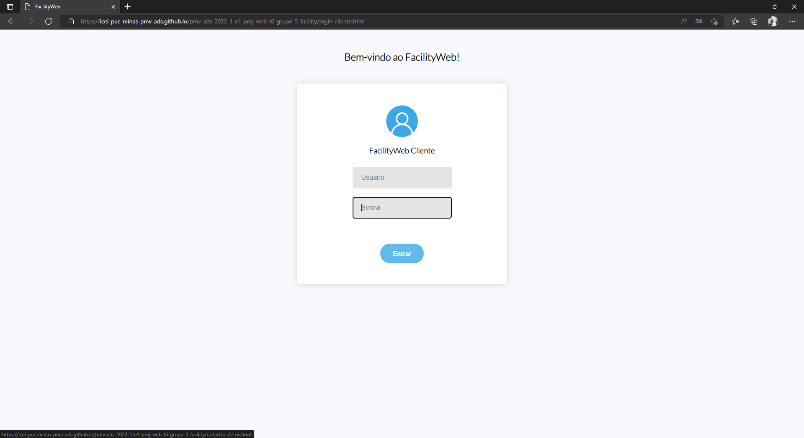
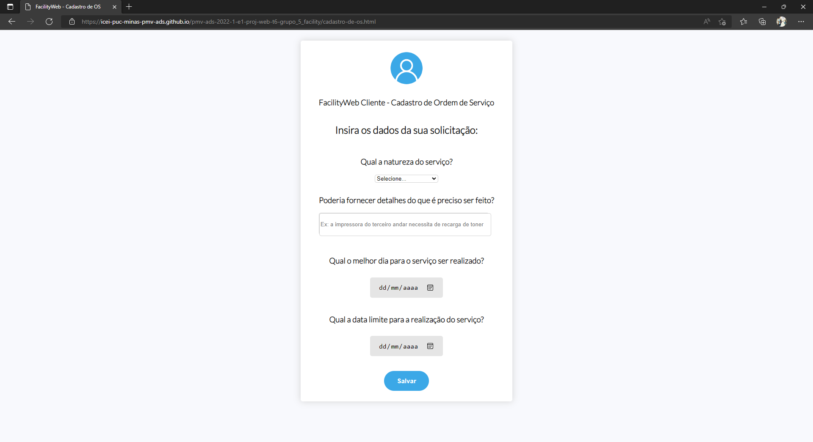

# Registro de Testes de Software

Pré-requisitos: <a href="3-Projeto de Interface.md"> Projeto de Interface</a>, <a href="8-Plano de Testes de Software.md"> Plano de Testes de Software</a>

•	Resultado CT-01- Visualizar tela de login:

 
 <h1>Teste com êxito.</h1>

•  Resultado CT-02-Visualizar página de inserção de dados das OSs:
 
 <h2>Teste com êxito.</h2>
